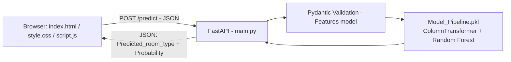

<div align="center">

# NYC Airbnb Room Type Classification

**An end-to-end machine learning classification system that predicts an Airbnb listing's room type from its location, pricing, and host/review characteristics — served through a FastAPI REST API and an interactive web application.**

[](https://www.python.org/)
[](https://fastapi.tiangolo.com/)
[](https://scikit-learn.org/)
[](https://pandas.pydata.org/)
[](https://render.com/)
[](https://nyc-airbnb-room-type-classification-1-jali.onrender.com/)

[**🚀 Live Demo**](https://nyc-airbnb-room-type-classification-1-jali.onrender.com/) · [**📦 Repository**](https://github.com/MrArshad07/NYC-Airbnb-Room-Type-Classification)

</div>

---

## 🚀 Live Demo

**[nyc-airbnb-room-type-classification-1-jali.onrender.com](https://nyc-airbnb-room-type-classification-1-jali.onrender.com/)**

The deployed application lets a recruiter or reviewer:

1. Enter a listing's **location** (latitude/longitude, borough, neighbourhood) — a live mini-map pins the coordinates as you type.
2. Enter **pricing & stay** details (price per night, minimum nights, yearly availability).
3. Enter **host & activity** details (total reviews, reviews/month, host's other listings).
4. Submit the form (or load a one-click **sample listing**) to send a prediction request to the FastAPI backend.
5. See the predicted room type, an animated confidence donut chart, and a full per-class probability breakdown.

`[ADD APPLICATION SCREENSHOT HERE]`

---

## 📖 Project Overview

Airbnb listings are labeled with a `room_type` (`Entire home/apt`, `Private room`, or `Shared room`), but that label is something a platform, a data pipeline, or a downstream pricing/search system may need to **infer or validate** from structural listing attributes alone — location, price, minimum stay, availability, and host/review activity — without relying on free-text descriptions.

This project frames that as a **supervised multiclass classification problem**: given a listing's structured attributes, predict its room type. It is built and shipped the way a small production ML feature would be — a single serialized inference pipeline, a typed/validated REST API, and a client that a real user (or another service) can call.

---

## 🎯 Problem Statement

| | |
|---|---|
| **Input** | Listing latitude, longitude, borough (`neighbourhood_group`), neighbourhood, price, minimum nights, number of reviews, reviews per month, host's listing count, yearly availability |
| **Output** | Predicted `room_type` + full class-probability distribution |
| **ML Type** | Supervised Learning |
| **Task** | Multiclass Classification (3 classes) |

---

## ✨ Key Features

**Location Features**
- `latitude`, `longitude`
- `neighbourhood_group` (borough), `neighbourhood`

**Property / Listing Features**
- `price`, `minimum_nights`

**Review / Availability Features**
- `number_of_reviews`, `reviews_per_month`, `availability_365`

**Host Features**
- `calculated_host_listings_count`

**Target**
- `room_type` → `Entire home/apt` | `Private room` | `Shared room`

---

## 📊 Dataset

| Category | Details |
|---|---|
| Dataset | [New York City Airbnb Open Data](https://www.kaggle.com/datasets/dgomonov/new-york-city-airbnb-open-data) (Kaggle) |
| Task | Multiclass Classification |
| Target | `room_type` |
| Classes | `Entire home/apt`, `Private room`, `Shared room` |
| Rows | 48,895 |
| Raw columns | 16 |
| Modeling features | 10 |

**Class distribution (raw data):**

| Room type | Count | Share |
|---|---:|---:|
| Entire home/apt | 25,409 | 52.0% |
| Private room | 22,326 | 45.7% |
| Shared room | 1,160 | 2.4% |

The target is **imbalanced** — `Shared room` is a small minority class, which directly shaped the evaluation metric and modeling choices below.

**Missing values (raw data):**

| Column | Missing |
|---|---:|
| `name` | 16 |
| `host_name` | 21 |
| `last_review` | 10,052 |
| `reviews_per_month` | 10,052 |

---

## 🧹 Data Quality & Cleaning

| Step | What was done | Why |
|---|---|---|
| Drop identifier / free-text columns | Removed `id`, `name`, `host_id`, `host_name`, `last_review` | These carry no generalizable signal for a tabular classifier — they either identify a specific row/host or are unstructured text, and including them risks leaking row-level noise or overfitting to a specific host/id. |
| Fill missing `reviews_per_month` | Filled the 10,052 missing values with `0` | Missingness here isn't random — a listing with no reviews yet has no `reviews_per_month` to record. `0` is the semantically correct value, not a statistical imputation. |
| Cap extreme outliers | Clipped `price` and `minimum_nights` at their 99th percentile | The raw data contains data-entry-error-scale outliers (a $10,000/night listing, a 1,250-minimum-night listing). Clipping (rather than deleting rows) removes their distorting effect on `StandardScaler` without shrinking the dataset or discarding minority-class rows. |
| Feature/target split | `X = df_clean.drop(columns=['room_type'])`, `y = df_clean['room_type']` | Standard separation before train/test splitting and pipeline fitting. |

After cleaning, the modeling dataset (`df_clean`) has 11 columns: the 10 features above plus `room_type`.

---

## 🔍 Exploratory Data Analysis

EDA was run in the standard order: missing-value inspection → univariate distributions → bivariate relationships with the target → correlation analysis → outlier inspection (`df.isnull().sum()`, `.hist()`, `sns.boxplot`, `sns.heatmap`, `sns.scatterplot` on `latitude`/`longitude` colored by `room_type`).

### Key EDA Findings

- `room_type` is imbalanced: **Shared room** makes up only ~2.4% of listings, versus ~52% Entire home/apt and ~46% Private room.
- `price`, `minimum_nights`, `number_of_reviews`, and `calculated_host_listings_count` are all heavily right-skewed with extreme high-end outliers, motivating the percentile-capping step above.
- Plotting `latitude`/`longitude` colored by `room_type` shows spatial clustering — location alone carries meaningful signal for the target, which is why `latitude`, `longitude`, `neighbourhood_group`, and `neighbourhood` were all kept as model features.

---

## 🛠️ Feature Engineering

| Feature | Transformation | Reason |
|---|---|---|
| `price`, `minimum_nights` | Percentile clipping (99th percentile) | Neutralizes extreme outliers before scaling, without deleting rows. |
| `reviews_per_month` | Missing-value fill with `0` | Encodes "no reviews yet" correctly rather than imputing a statistical average. |
| All numeric features | Median imputation + `StandardScaler` | Puts features with very different scales (e.g. `price` vs. `latitude`) on comparable footing for distance/gradient-sensitive models, with robust handling of any residual missing values. |
| `neighbourhood_group`, `neighbourhood` | Most-frequent imputation + `OneHotEncoder(handle_unknown='ignore')` | Converts categoricals into a model-usable numeric form; `handle_unknown='ignore'` lets the API safely score a neighbourhood string it has never seen during training instead of erroring out. |

No manual log-transforms, target encoding, or feature-selection step was applied — scaling, imputation, and one-hot encoding (all inside the `ColumnTransformer` below) were sufficient for the models evaluated.

---

## 🔄 Machine Learning Pipeline

```text
Raw Airbnb Data (AB_NYC.csv, 48,895 rows)
       ↓
Data Cleaning (drop identifiers, fill reviews_per_month, cap outliers)
       ↓
Feature / Target Split (X, y)
       ↓
Train/Test Split (67% / 33%, stratified, random_state=42)
       ↓
ColumnTransformer Preprocessing (impute + scale numeric, impute + one-hot categorical)
       ↓
Model Comparison (Logistic Regression, Decision Tree, Random Forest, Gradient Boosting)
       ↓
Hyperparameter Tuning (RandomizedSearchCV on Random Forest, scoring = f1_macro)
       ↓
Final Model Evaluation on held-out test set
       ↓
Serialization (joblib → Model_Pipeline.pkl)
       ↓
FastAPI (/predict)
       ↓
Interactive Web UI (index.html / style.css / script.js)
       ↓
Render Deployment
```

---

## ⚙️ Preprocessing Architecture

```python
numeric_pipeline = Pipeline([
    ("impute", SimpleImputer(strategy="median")),
    ("scale", StandardScaler())
])

categorical_pipeline = Pipeline([
    ("impute", SimpleImputer(strategy="most_frequent")),
    ("encode", OneHotEncoder(handle_unknown="ignore"))
])

preprocessor = ColumnTransformer([
    ("numerical", numeric_pipeline, numerical_cols),
    ("categorical", categorical_pipeline, categorical_cols)
])
```

The `ColumnTransformer` is the **first step of every model `Pipeline`** — never applied manually or ahead of time. This guarantees:

- Preprocessing statistics (medians, most-frequent categories, scaling parameters, one-hot categories) are **learned only on training data**, preventing test-set leakage.
- The exact same transformation is replayed identically at **inference time**, because the fitted `ColumnTransformer` is serialized as part of the pipeline object — the FastAPI endpoint never re-implements preprocessing logic, eliminating train/serve skew.

---

## 🤖 Models Evaluated

All four models were wrapped in the same `preprocessor` pipeline and compared (`class_weight="balanced"` applied to Logistic Regression, Decision Tree, and Random Forest — Gradient Boosting does not support `class_weight`, so it was left at its default):

| Model | Accuracy | F1 (macro) | Notes |
|---|---:|---:|---|
| Logistic Regression | 0.659 | 0.522 | Linear baseline |
| Decision Tree | 0.782 | 0.647 | Single tree, prone to overfitting |
| Random Forest | **0.851** | **0.715** | Best of the four — selected for tuning |
| Gradient Boosting | 0.850 | 0.705 | Competitive, but no `class_weight` support |

**SMOTE** (`imblearn.over_sampling.SMOTE`) was imported and considered as an imbalance-handling strategy, but was **not used** in the final pipelines — it was assessed as carrying a higher risk of overfitting and data leakage on this feature set than class-weighting, so `class_weight="balanced"` plus macro-F1 optimization was used instead.

Random Forest was selected as the candidate for tuning based on its top macro-F1 in this comparison.

---

## 📈 Model Evaluation

**Primary metric: macro-F1** (not accuracy). With `Shared room` at only ~2.4% of listings, a model can score high accuracy while all but ignoring the minority class — macro-F1 weights all three classes equally, so it directly reflects how well the model does on the imbalanced classes, not just the dominant ones.

A confusion matrix (`sklearn.metrics.confusion_matrix`) was plotted against the held-out test set for per-class error inspection — see the training notebook for the full matrix.

---

## 🔧 Hyperparameter Tuning

```text
Method: RandomizedSearchCV
Estimator: RandomForestClassifier(class_weight="balanced")
Search space:
    n_estimators:      [100, 200, 150, 300]
    max_depth:          [8, 12, 15, 20, None]
    min_samples_split:  [2, 5, 10]
n_iter: 10
cv: 3
scoring: f1_macro
random_state: 42
```

**Best parameters found:**

```text
n_estimators: 200
min_samples_split: 10
max_depth: None
```

**Best CV macro-F1 (training set, 3-fold):** `0.7323`

---

## 🏆 Final Model

| | |
|---|---|
| **Algorithm** | Random Forest Classifier (`class_weight="balanced"`) |
| **Key hyperparameters** | `n_estimators=200`, `max_depth=None`, `min_samples_split=10` |
| **Test Accuracy** | **0.8553** |
| **Test F1 (macro)** | **0.7367** |
| **Serialization** | `joblib.dump(best_pipeline, "Model_Pipeline.pkl", compress=3)` |
| **Saved artifact** | `Model_Pipeline.pkl` |

Random Forest was selected as the final model because it achieved the highest macro-F1 in the initial four-model comparison and improved further under tuning, while remaining robust to the mixed numeric/categorical, imbalanced feature set — without the extra risk profile of a synthetic-sampling approach like SMOTE.

The gap between test accuracy (0.855) and test macro-F1 (0.737) is expected and consistent with the ~2.4% minority class: the model performs well overall but, honestly, is weaker specifically on `Shared room` than the headline accuracy number would suggest.

### Model Interpretability

Not currently implemented — the notebook does not include SHAP, permutation importance, or coefficient/feature-importance analysis.

> **Future Improvement:** Add model explainability (e.g. `feature_importances_`, permutation importance, or SHAP) so individual predictions and global feature influence can be inspected, not just aggregate accuracy/F1.

---

## 🏗️ Application Architecture



The entire preprocessing + inference step is a single call — `model.predict()` / `model.predict_proba()` — against the deserialized pipeline object; `main.py` contains no manual feature-transformation code.

---

## 🔌 API

Built with **FastAPI**, with `CORSMiddleware` configured to accept requests from any origin (so the static frontend can be hosted independently of the API and still call it).

### `GET /`

Simple health/greeting check.

**Response:**
```json
"Hello! Welcome to the Airbnb Room Type Prediction API."
```

### `POST /predict`

**Request body** (validated via a Pydantic `Features` model):

```json
{
  "latitude": 40.71427,
  "longitude": -74.00597,
  "price": 220,
  "minimum_nights": 2,
  "number_of_reviews": 84,
  "reviews_per_month": 2.1,
  "calculated_host_listings_count": 1,
  "availability_365": 210,
  "neighbourhood_group": "Manhattan",
  "neighbourhood": "SoHo"
}
```

**Validation rules (enforced by Pydantic `Field` constraints):**

| Field | Constraint |
|---|---|
| `latitude` | -90 to 90 |
| `longitude` | -180 to 180 |
| `price` | > 0 |
| `minimum_nights` | 1 to 365 |
| `number_of_reviews` | ≥ 0 |
| `reviews_per_month` | ≥ 0 |
| `calculated_host_listings_count` | ≥ 0 |
| `availability_365` | 0 to 365 |
| `neighbourhood_group` | non-empty string |
| `neighbourhood` | non-empty string |

Invalid input is rejected automatically by FastAPI/Pydantic with a `422` response before it ever reaches the model.

**Response:**

```json
{
  "Predicted_room_type": "Entire home/apt",
  "Probability": [0.81, 0.03, 0.16]
}
```

> **Note:** `Probability` is returned as a plain array aligned to the model's internal class order (`best_pipeline.classes_`), without labels attached in the response body. The frontend's predicted-label display always uses `Predicted_room_type` directly; only the visual breakdown chart infers labels for the array. A natural API improvement is to also return `"Classes": model.classes_.tolist()` so consumers don't have to infer the order.

---

## 🎨 Frontend

A dependency-free **HTML / CSS / JavaScript** single-page interface (`index.html`, `style.css`, `script.js`) — no framework or build step required.

- **Form with live client-side validation** mirroring the API's own Pydantic constraints (range/required checks, inline error messages).
- **Live mini-map** — an SVG pin that moves in real time as latitude/longitude are typed, with borough clusters that highlight on selection.
- **Sample listing loader** for one-click demoing without manual data entry.
- **Animated result reveal** — a hand-built SVG donut chart that draws itself, a count-up confidence percentage, and per-class probability bars, once a prediction returns.
- **Configurable API base URL** (stored in `localStorage`, default `http://127.0.0.1:8000`) with a live connection-status indicator — lets the same static frontend target a local backend during development or the deployed backend in production.
- **Error and loading states** are explicit UI states (not just spinners) with plain-language messaging when the API is unreachable or returns a validation error.
- Responsive layout and reduced-motion support (`prefers-reduced-motion`) are respected throughout.

---

## ☁️ Deployment

**Platform:** [Render](https://render.com/)

**Flow:** GitHub → Render → FastAPI (`main.py`) → `Model_Pipeline.pkl` → Browser (`index.html`)

- Dependencies are installed from `requirements.txt`.
- `Model_Pipeline.pkl` is loaded once at process startup (`joblib.load`) and reused across requests — the model is not reloaded per prediction.
- The API's open CORS policy (`allow_origins=["*"]`) and the frontend's configurable API base URL mean the static frontend is not hard-wired to a single backend origin.

No CI/CD pipeline is present in the repository — deployment is a direct Render build from the `main` branch.

---

## 📁 Project Structure

```text
NYC-Airbnb-Room-Type-Classification/
├── __pycache__/          # compiled Python bytecode
├── Model_Pipeline.pkl    # serialized preprocessing + trained model pipeline
├── main.py               # FastAPI application (prediction API)
├── index.html            # frontend markup
├── style.css             # frontend styling
├── script.js             # frontend logic (validation, API calls, charts)
├── requirements.txt      # Python dependencies
└── README.md
```

> The training notebook (`NYC_Airbnb_Room_Type_Classification.ipynb`) and the raw dataset (`AB_NYC.csv`) used to produce `Model_Pipeline.pkl` are **not committed to this repository** — only the exported pipeline artifact and the serving code are.

---

## 💻 Installation & Local Setup

### Clone

```bash
git clone https://github.com/MrArshad07/NYC-Airbnb-Room-Type-Classification.git
cd NYC-Airbnb-Room-Type-Classification
```

### Create a virtual environment

**Windows:**
```bash
python -m venv venv
venv\Scripts\activate
```

**Mac/Linux:**
```bash
python3 -m venv venv
source venv/bin/activate
```

### Install dependencies

```bash
pip install -r requirements.txt
```

### Run the API

```bash
uvicorn main:app --reload
```

The API will be available at `http://127.0.0.1:8000`.

### Run the frontend

Open `index.html` directly in a browser, or serve it locally:

```bash
python -m http.server 5500
```

If the API isn't already at `http://127.0.0.1:8000`, click the settings (⚙) icon in the app and update the API base URL.

---

## 🧪 API Testing

FastAPI automatically exposes interactive Swagger documentation at:

```text
/docs
```

You can also test directly with `curl`:

```bash
curl -X POST http://127.0.0.1:8000/predict \
  -H "Content-Type: application/json" \
  -d '{
    "latitude": 40.71427, "longitude": -74.00597, "price": 220,
    "minimum_nights": 2, "number_of_reviews": 84, "reviews_per_month": 2.1,
    "calculated_host_listings_count": 1, "availability_365": 210,
    "neighbourhood_group": "Manhattan", "neighbourhood": "SoHo"
  }'
```

---

## ♻️ Reproducibility

1. **Dataset:** Download the [NYC Airbnb Open Data](https://www.kaggle.com/datasets/dgomonov/new-york-city-airbnb-open-data) CSV from Kaggle.
2. **Preprocessing:** Run the cleaning steps (drop identifier columns, fill `reviews_per_month`, clip `price`/`minimum_nights` outliers) as documented above.
3. **Training:** Fit the `ColumnTransformer` + model `Pipeline`s on a stratified train split (`test_size=0.33`, `random_state=42`).
4. **Evaluation:** Compare models with macro-F1 as the primary metric; tune the best candidate with `RandomizedSearchCV`.
5. **Serialization:** `joblib.dump(best_pipeline, "Model_Pipeline.pkl", compress=3)`.
6. **API:** Load the pipeline in `main.py` and serve it via FastAPI (`uvicorn main:app`).
7. **Deployment:** Push to GitHub and deploy the service on Render.

---

## 🧠 Engineering Challenges & Decisions

| Challenge | Decision | Reason | Result |
|---|---|---|---|
| Severe class imbalance (`Shared room` ≈ 2.4%) | Used `class_weight="balanced"` and optimized for macro-F1 instead of accuracy; evaluated but rejected SMOTE | Macro-F1 and class-weighting address imbalance without the overfitting/leakage risk synthetic oversampling can introduce on this feature mix | Macro-F1 improved from 0.522 (Logistic Regression) to 0.737 (tuned Random Forest) on the held-out test set |
| High-cardinality categorical (`neighbourhood`, 200+ distinct values) | One-hot encoded with `handle_unknown="ignore"` rather than dropped or target-encoded | Preserves neighbourhood-level signal while safely scoring unseen neighbourhood strings at inference | API accepts previously unseen neighbourhood values without erroring, at the cost of a higher-dimensional feature space |
| Extreme outliers in `price` (max $10,000) and `minimum_nights` (max 1,250) | Percentile-capped (99th percentile) instead of deleting rows | Preserves sample size — including minority-class rows — while preventing a handful of data-entry errors from dominating scaled features | Cleaner numeric distributions for `StandardScaler` with no rows discarded |
| Missing `reviews_per_month` (10,052 rows) | Filled with `0`, not mean/median | The missingness is meaningful ("no reviews yet"), not random | No artificial averages injected into a semantically clear feature |
| Preprocessing/inference consistency | Wrapped `ColumnTransformer` as the first step of the same `Pipeline` as the classifier, serialized as one artifact | Guarantees preprocessing learned on training data is replayed identically at inference | `main.py` calls `model.predict()` directly on a raw DataFrame — zero manual preprocessing code in the API |
| Choosing an evaluation metric under imbalance | Used macro-F1 (not accuracy) for model comparison and `RandomizedSearchCV` scoring | Accuracy can look strong while a ~2.4% minority class is predicted poorly; macro-F1 weights all classes equally | Tuning surfaced a Random Forest configuration selected on minority-class-aware performance, not just overall accuracy |

---

## ⚠️ Limitations

- The dataset is a single historical snapshot of NYC Airbnb listings; pricing and availability patterns will drift over time.
- Geographic scope is limited to New York City — the model does not generalize to other cities/markets.
- `Shared room` is a severe minority class (~2.4%); despite class-weighting, minority-class predictions are the least reliable of the three, as shown by the gap between test accuracy (0.855) and macro-F1 (0.737).
- No model interpretability (SHAP, permutation importance, feature importances) is currently implemented.
- CORS is fully open (`allow_origins=["*"]`) — reasonable for a public demo, but would need tightening for a production deployment handling real user data.
- `__pycache__` is committed to the repository.
- The training notebook and raw dataset are not included in the repository — only the exported model artifact and serving code are.

---

## 💼 Skills Demonstrated

**Machine Learning**
- Supervised Learning · Multiclass Classification · Class-imbalance handling · Model comparison · Hyperparameter tuning (`RandomizedSearchCV`) · Feature engineering

**Data Science**
- Pandas · NumPy · Exploratory Data Analysis · Data cleaning · Outlier treatment

**ML Engineering**
- scikit-learn `Pipeline` / `ColumnTransformer` · Consistent train/inference preprocessing · Model serialization (`joblib`)

**Backend**
- FastAPI · REST API design · Pydantic input validation · CORS configuration

**Frontend**
- HTML / CSS / JavaScript · Client-side validation · Fetch-based API integration · SVG-based data visualization

**Deployment**
- Git · GitHub · Render

---

## 🎯 Recruiter Snapshot

| Area | Implementation |
|---|---|
| Problem | Airbnb room-type classification from listing attributes |
| ML Task | Multiclass classification (3 classes) |
| Data | NYC Airbnb Open Data (Kaggle), 48,895 listings |
| Preprocessing | `ColumnTransformer`: median-impute + scale (numeric), most-frequent-impute + one-hot (categorical) |
| Models compared | Logistic Regression, Decision Tree, Random Forest, Gradient Boosting |
| Final model | Random Forest (`class_weight="balanced"`, tuned via `RandomizedSearchCV`) |
| Test performance | Accuracy 0.855 · macro-F1 0.737 |
| API | FastAPI (`/predict`, Pydantic-validated) |
| Frontend | Vanilla HTML/CSS/JS interactive UI |
| Deployment | Render |
| Version Control | Git / GitHub |

---

## 📸 Application Preview


---

## 📄 License

No license file is currently included in this repository.

---

## 👤 Author

**MrArshad07**
GitHub: [@MrArshad07](https://github.com/MrArshad07)
LINKEDIN: https://www.linkedin.com/in/arshadsayyad7/
